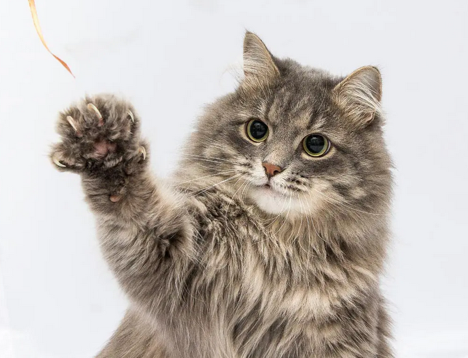

**Galina Dyrkheeva**

**Discord:** Galina#8625

**About me:** I want to become a junior front-end developer. At moment I don't have software developer experience, but I am eager to have one.

**Skills:**

- HTML - beginner
- CSS - beginner
- English - A2
- Git - started to learn

**Code sample**
```
function solution(str) {
  return str.split("").reverse().join("")
}
```

**Education** - bachelor of economics

**Projects:** 
- CV  https://github.com/dyrkheeva/rsschool-cv
